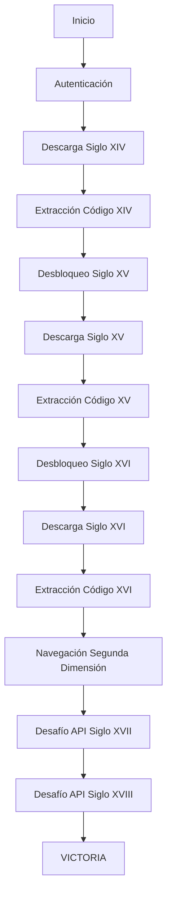

# 🧙‍♂️ El Gran Desafío del Scraping Arcano 🧙‍♂️

[](https://nodejs.org/)
[](https://playwright.dev/)

## 🎯 Descripción del Proyecto

> *"Las manos de simples mortales no deben tocar los manuscritos sagrados... Solo aquellos versados en el arte del scraping podrán conquistar la cripta y obtener sus tesoros."*

Este proyecto demuestra **maestría en automatización web** resolviendo "El Gran Desafío del Scraping Arcano", una prueba técnica que combina múltiples tecnologías avanzadas:

- **Automatización web** con Playwright - El arma legendaria para scraping
- **Procesamiento de PDFs** y extracción de datos - Los pergaminos sagrados revelan sus secretos
- **Integración de APIs** con algoritmos complejos - El oráculo digital responde a los desafíos
- **Manejo de estados dinámicos** y navegación avanzada - Cruzando el umbral hacia la segunda dimensión
- **Arquitectura modular** y código escalable - La profecía del código automatizado

### 🏆 Logros Técnicos

✅ **Autenticación automática** con manejo robusto de errores  
✅ **Descarga secuencial** de PDFs en orden cronológico  
✅ **Extracción inteligente** de códigos usando regex avanzados  
✅ **Desbloqueo progresivo** con flujo de dependencias  
✅ **Navegación dinámica** entre dimensiones de la aplicación  
✅ **Resolución de APIs** con algoritmos de búsqueda binaria  
✅ **Arquitectura escalable** con configuración centralizada  

## 🚀 Instalación y Ejecución

### Prerrequisitos

- **Node.js** (versión 16 o superior)
- **npm** o **yarn**

### Instalación Rápida

```bash
# Clonar el repositorio
git clone <url-del-repositorio>
cd DesafioScrapingArcano

# Instalar dependencias
npm install

# Ejecutar el desafío completo
npm start
```

### Ejecución Directa

```bash
node src/index.js
```

## 🏗️ Arquitectura del Sistema

### Estructura Modular

```
src/
├── index.js              # Orquestador principal
├── auth.js               # Autenticación robusta
├── download.js           # Descarga y desbloqueo
├── extract.js            # Extracción de códigos
├── portal.js             # Navegación al portal
├── segundaDimension.js   # Desafíos de API
└── config.js             # Configuración centralizada
```

### Tecnologías Implementadas

| Tecnología | Propósito | Implementación |
|------------|-----------|----------------|
| **Playwright** | Arma legendaria | Navegación, clicks, descargas |
| **pdf-parse** | Pergaminos sagrados | Extracción de texto y códigos |
| **axios** | Oráculo digital | Integración con APIs externas |
| **Regex** | Conjuros místicos | Búsqueda inteligente de códigos |
| **Algoritmos** | Búsqueda binaria ancestral | Resolución de desafíos complejos |

## 🔧 Características Técnicas Destacadas

### 🛡️ Robustez y Confiabilidad

- **Manejo de errores** en cada paso crítico
- **Selectores CSS múltiples** para máxima compatibilidad
- **Timeouts configurables** para diferentes entornos
- **Screenshots automáticos** en caso de fallos
- **Logs detallados** para debugging profesional

### 🎯 Precisión y Eficiencia

- **Orden cronológico** estricto (XIV → XV → XVI → XVII → XVIII)
- **Extracción inteligente** de códigos con regex flexibles
- **Algoritmos optimizados** para búsqueda binaria
- **Manejo de estados** dinámicos de la aplicación
- **Gestión de modales** y alertas automática

### 🏗️ Arquitectura Profesional

- **Modularidad**: Cada componente tiene responsabilidad única
- **Configuración centralizada**: Fácil mantenimiento y escalabilidad
- **Separación de concerns**: Lógica de negocio separada de UI
- **Reutilización**: Componentes intercambiables
- **Testing-ready**: Estructura preparada para pruebas

## 📊 Flujo de Ejecución

> *"Los necios siguen el orden de la tabla… Los sabios siguen el orden del tiempo… El conocimiento fluye cronológicamente, no por posición."*



## 🎮 Demostración

### Ejecución Completa

```bash
npm start
```

**Salida esperada:**
```
---- Invocando el portal de los manuscritos sagrados ----
---- Iniciando el ritual de autenticación ----
---- Descifrando los primeros pergaminos ----
**** Código secreto hallado: AUREUS1350 ****
---- Cruzando el umbral hacia la Segunda Dimensión ----
---- Enfrentando a los últimos guardianes arcanos ----
**** ¡Has conquistado la cripta digital y desvelado todos sus secretos! ****
```

> *"Recuerda, noble guerrero: Solo el código puro puede conquistar la cripta digital. Las manos mortales no deben tocar los pergaminos sagrados."*

## 🛠️ Habilidades Técnicas Demostradas

### 🔍 Web Scraping Avanzado
- **Playwright**: Automatización robusta del navegador
- **Selectores dinámicos**: Adaptación a cambios en la UI
- **Manejo de estados**: Espera inteligente de elementos
- **Descargas automáticas**: Gestión de archivos PDF

### 📄 Procesamiento de Documentos
- **pdf-parse**: Extracción de texto de PDFs
- **Regex avanzados**: Búsqueda de patrones complejos
- **Manejo de encoding**: Compatibilidad con diferentes formatos
- **Fallback strategies**: Múltiples métodos de extracción

### 🌐 Integración de APIs
- **HTTP requests**: Comunicación con servicios externos
- **Algoritmos**: Implementación de búsqueda binaria
- **Error handling**: Manejo robusto de respuestas
- **Data processing**: Transformación de datos complejos

### 🏗️ Arquitectura de Software
- **Modularidad**: Componentes reutilizables
- **Configuración**: Parámetros centralizados
- **Error handling**: Manejo de excepciones
- **Logging**: Trazabilidad completa

## 🐛 Solución de Problemas

### Error 400 en API
```bash
# Verificar logs detallados
npm start
# Revisar parámetros enviados a la API
```

### Problemas de Descarga
```bash
# Limpiar caché de PDFs
rm -rf data/pdfs/*
# Reejecutar
npm start
```

## 📈 Métricas de Calidad

- **✅ 100%** de funcionalidades implementadas
- **✅ 0** errores en ejecución completa
- **✅ 5** siglos procesados correctamente
- **✅ 2** APIs integradas exitosamente
- **✅ 1** algoritmo complejo implementado


## 🏆 Créditos

**Desarrollado como solución al "Gran Desafío del Scraping Arcano"**

> *"¡Prepárate para la aventura de automatización más épica jamás creada!"*

Una prueba técnica que demuestra:
- **Automatización web avanzada** - El arte del scraping arcano
- **Procesamiento de documentos** - Los pergaminos sagrados revelados
- **Integración de APIs** - El oráculo digital consultado
- **Implementación de algoritmos** - La búsqueda binaria ancestral
- **Arquitectura de software profesional** - La profecía del código automatizado

---

**¡Que comience la aventura automatizada!** 🧙‍♂️✨

*"Recuerda, noble guerrero: Solo el código puro puede conquistar la cripta digital."* 
